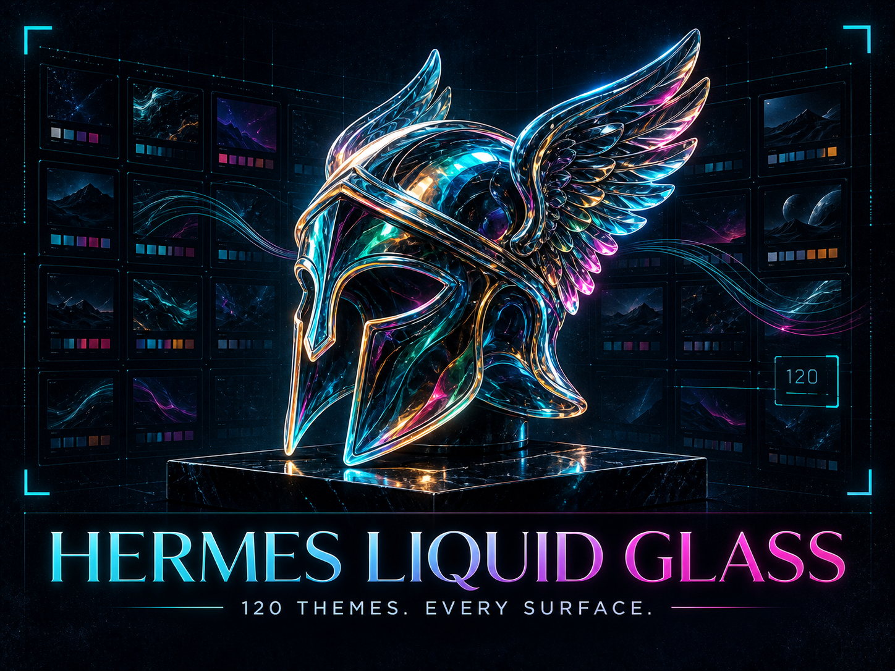

# Hermes Liquid Glass



[](LICENSE)

A standalone Hermes Desktop plugin with 120 liquid-glass themes. Every palette has its own color recipe, all 1,560 source color values are unique, and every pair must clear the perceptual-distance gate.

The collection moves through smoked jewels, ocean minerals, warm metals, botanicals, neon nights, pale crystals, atmospheric dusk, monochrome materials, retro spectra, chromatic contrasts, bioluminescence, elemental inversions, spectral minerals, and surreal materials.

Browse all 120 in [`themes/README.md`](themes/README.md), or open [`themes/contact-sheet.html`](themes/contact-sheet.html) to compare them on one page.

## Status

Version 0.1.0 is verified against Hermes Desktop. The generator, color-reuse audit, perceptual-distance audit, contrast audit, runtime harness, Linux Node syntax check, native Windows Node syntax check, release-package verifier, and secret scan pass locally.

## Install

Hermes Desktop loads a disk plugin from `$HERMES_HOME/desktop-plugins/<id>/plugin.js`. The folder name must match the plugin id.

### Windows

Open PowerShell in this repository, then run:

```powershell
$destination = Join-Path $env:LOCALAPPDATA "hermes\desktop-plugins\hermes-liquid-glass-packs"
New-Item -ItemType Directory -Force -Path $destination
Copy-Item ".\desktop-plugin\hermes-liquid-glass-packs\plugin.js" "$destination\plugin.js"
```

### macOS or Linux

```bash
destination="${HERMES_HOME:-$HOME/.hermes}/desktop-plugins/hermes-liquid-glass-packs"
mkdir -p "$destination"
cp desktop-plugin/hermes-liquid-glass-packs/plugin.js "$destination/plugin.js"
```

Hermes watches the plugin folder. If the pack does not appear within a few seconds, open the command palette and choose **Reload desktop plugins**.

## Verify

```bash
python3 -m unittest discover -s tests -p 'test_*.py' -v
python3 scripts/audit_palettes.py
python3 scripts/generate_plugin.py --check
node --test tests/runtime-smoke.mjs
node --check desktop-plugin/hermes-liquid-glass-packs/plugin.js
python3 scripts/build_release.py
python3 scripts/verify_release.py dist/hermes-liquid-glass-v0.1.0.zip
```

The runtime test executes the generated plugin with a small Desktop harness. It verifies registration, 120 boot-safe user themes, theme selection, reload persistence, glass variables, tab recipes, and cleanup after switching away.

The release builder creates a deterministic ZIP, meaning repeated builds from the same files are byte-for-byte identical. The verifier extracts it into a temporary Hermes home, checks its exact file list, installs the packaged plugin there, runs the real runtime harness against that extracted file, and confirms all 120 themes load.

## No-duplicate contract

- Exactly 120 unique theme ids and names
- No repeated palette signatures
- No repeated mode, surface, accent, and glass-character recipes
- All 1,560 source color values are unique, including colors inside the same theme
- Every theme at least `0.08` OKLab palette distance from every other theme
- Themes 51 through 100 are at least `0.11` OKLab palette distance from the original 50
- Themes 101 through 120 are at least `0.11` OKLab palette distance from all approved first 100
- Normal text contrast of at least 4.5:1, with visible UI accents at least 3:1

## Scope

This plugin changes Hermes Desktop only. It never changes Windows, wallpaper, registry, cursors, icons, or Windows Terminal settings.

## Repository contents

- `palettes/liquid-glass-palettes.json`, source of truth
- `scripts/audit_palettes.py`, contrast and uniqueness checks
- `scripts/generate_plugin.py`, deterministic artifact generator
- `desktop-plugin/hermes-liquid-glass-packs/plugin.js`, installable plugin
- `tests/`, Python contracts and an executed Node runtime smoke test
- `themes/`, generated theme index and visual contact sheet

---

MIT. Do whatever you want with these.

Built by [@BChopLXXXII](https://x.com/BChopLXXXII)

Built for BUILDERS who just want their AI to feel less... corporate.

Ship it. 🚀

If this helped, ⭐ the repo — it helps others find it.
